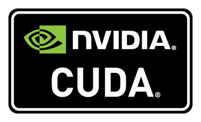

# 로봇플러스 협업지능 챌린지 2024용 ROS CUDA Docker
>  협업지능 챌린지 2024용 ROS 도커 이미지 생성을 위한 레포지토리

## 1. 도커파일 기본 구성 환경
  

- Ubuntu 20.04 Focal
- Nvidia CUDA 11.3.1
- ROS1 Noetic
- OpenSSH
- Add New User
- Add Useful ROS, catkin Setup to bashrc
<br>
<br>

## 2. 도커파일 생성시 사용되는 Arguments
- UBUNTU_RELEASE: 가져올 Ubuntu OS의 버전
    + 기본값: 20.04

- CUDA_VERSION: 가져올 Nvidia CUDA 이미지의 버전
    + 기본값: 11.3.1

- CUDA_ENV_VERSION: 환경변수 설정에 사용할 Nvidia CUDA 버전
    + 기본값: 11.3

- CUDA_PURPOSE: 가져올 Nvidia CUDA 이미지의 배포 종류(devel, runtime)
    + 기본값: "devel"

- CUDNN_VERSION: 추가적으로 넣을 CuDNN 여부 및 버전
    + 기본값: "" (빈 값은 CuDNN 넣지 않음)
    + CuDNN 추가할 경우의 값: cudnn8-

- ROS_VER: 설치할 ROS의 버전
    + 기본값: noetic

- NAME_CATKIN_WS: 설치될 catkin 워크스페이스의 이름
    + 기본값: catkin_ws

- USER_NAME: 사용할 도커의 유저 이름
    + 기본값: ros

- PASSWORD: 사용할 도커의 유저의 비밀번호
    + 기본값: keti
<br>
<br>

## 3. 챌린지용 ROS CUDA 도커파일 빌드 방법
- git 레포지토리 클론
    ```bash
    git clone https://github.com/robot-plus-program/robotplus-challenge-2024-ros.git
    ```

- 레포지토리로 이동
    ```bash
    cd robotplus-challenge-2024-ros
    ```

- 터미널에서 CLI로 도커 이미지 빌드

    ```bash
    docker build -t robotplus-challenge-2024-ros-cuda:base . \
            --build-arg UBNUTU_RELEASE=20.04 \
            --build-arg CUDA_VERSION=11.3.1 \
            --build-arg CUDA_ENV_VERSION=11.3 \
            --build-arg CUDA_PURPOSE=devel \
            --build-arg CUDNN_VERSION="" \
            --build-arg ROS_VER=noetic \
            --build-arg NAME_CATKIN_WS=catkin_ws \
            --build-arg USER_NAME=ros \
            --build-arg PASSWORD=keti
    ```

- 또는 build.bash 파일 사용
    + 파일 안에 환경변수 값 수정하여 사용
    ```bash
    chmod 755 build.bash && bash build.bash
    ```
<br>
<br>

## 4. 챌린지용 ROS CUDA 도커파일 실행 방법
- 터미널에 입력
    + -p 에는 SSH 접속에 사용할 포트번호 입력(예:4000)
    ```bash
    docker run -d --gpus all -p 4000:22 robotplus-challenge-2024-ros-cuda:base
    ```

- 또는 run.bash 파일 사용
    + 파일 안에 ssh_port_num의 값 수정하여 사용(예:ssh_port_num=4000)
    ```bash
    chmod 755 run.bash && bash run.bash
    ```
<br>
<br>

## 5. 챌린지용 ROS CUDA 도커 접속 방법
- 터미널에 입력
    + 도커 실행할때 사용한 SSH 포트번호와 USER_NAME, PASSWORD를 사용

    ```bash
    ssh ros@robotplus.duckdns.org -p 4000
    ```
